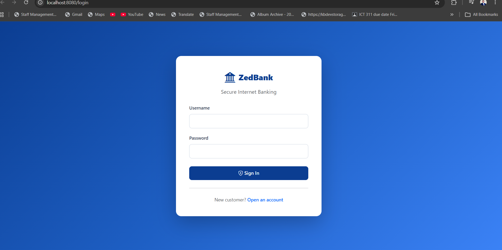
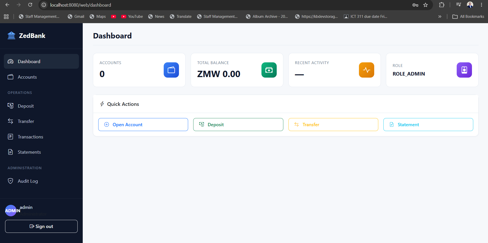

# 🏦 ZedBank — Core Banking Application

A production-grade **core banking system** built with **Java 21, Spring Boot 3.3, MySQL 8, and JWT authentication**. Implements real banking-domain patterns used by financial institutions: double-entry accounting, segregation of duties, audit trails, idempotency, and transaction integrity.


---

## 📸 Screenshots


> 
> | Login page | `http://localhost:8080/login` |

> | Admin dashboard | After logging in as `admin` |

> | Accounts list | Sidebar → Accounts |
> | Transfer form | Sidebar → Transfer |
> | Transaction history | Sidebar → Transactions |
> | Account statement | Sidebar → Statements |
> | Audit log | Sidebar → Audit Log (as admin) |


## ✨ Features

### Banking Core
- 💰 **Double-entry ledger** — every transaction records matching DEBIT and CREDIT entries with running balance
- 🔄 **Deposits, transfers, reversals** — atomic and concurrency-safe
- 📊 **Account statements** — date-range ledger with opening/closing balances
- 🚦 **Daily transaction limits** — per-account debit caps enforced at DB level (KYC/AML)
- 🔑 **Idempotency keys** — network-retry protection using SHA-256 hashing
- 🏦 **Multi-currency ready** — decimal-precise amounts using `BigDecimal`
- 📝 **KYC verification workflow** — customers register, tellers verify before accounts open

### Security
- 🔐 **JWT authentication** for the REST API (stateless)
- 🍪 **Session authentication** for the web UI (form login)
- 🛡️ **Role-based access control** — 5 roles: Admin, Supervisor, Teller, Customer, Auditor
- 🔒 **BCrypt** password hashing (strength 12)
- 📋 **Segregation of duties** — teller ≠ supervisor ≠ auditor

### Enterprise
- 📜 **Audit logging** — every change captured (actor, action, entity, before/after, IP)
- 🔒 **Pessimistic locking** — `SELECT ... FOR UPDATE` with deterministic lock ordering
- ⚡ **Optimistic locking** — `@Version` for account balance updates
- 📦 **Flyway migrations** — 10 versioned SQL migrations
- 📈 **Observability** — Actuator, health checks, Prometheus metrics
- 🐳 **Docker-ready** — multi-stage Dockerfile + Docker Compose

---

## 🏗️ Architecture

```
┌─────────────────────────────────────────────────────────────┐
│                    Client Layer                             │
│  ┌──────────────┐  ┌──────────────┐  ┌──────────────┐      │
│  │ Web Browser  │  │  Mobile App  │  │  Swagger UI  │      │
│  │ (Thymeleaf)  │  │  (REST API)  │  │  (API Docs)  │      │
│  └──────┬───────┘  └──────┬───────┘  └──────┬───────┘      │
└─────────┼─────────────────┼─────────────────┼──────────────┘
          │                 │                 │
          │       HTTPS / JWT / Session       │
          ▼                 ▼                 ▼
┌─────────────────────────────────────────────────────────────┐
│              Spring Boot Application (Port 8080)            │
│  ┌─────────────────────────────────────────────────────┐   │
│  │  Filter Chain                                       │   │
│  │  ├─ JwtAuthFilter (API)                             │   │
│  │  ├─ SessionAuthFilter (Web)                         │   │
│  │  └─ SecurityFilterChain (RBAC)                      │   │
│  └─────────────────────────────────────────────────────┘   │
│  ┌─────────────────────────────────────────────────────┐   │
│  │  Controllers (REST + Web)                           │   │
│  │  ├─ AuthController                                  │   │
│  │  ├─ AccountController                               │   │
│  │  ├─ TransactionController                           │   │
│  │  ├─ StatementController                             │   │
│  │  └─ AuditController                                 │   │
│  └─────────────────────────────────────────────────────┘   │
│  ┌─────────────────────────────────────────────────────┐   │
│  │  Services (Business Logic)                          │   │
│  │  ├─ AuthService         ── JWT + registration       │   │
│  │  ├─ AccountService      ── account lifecycle        │   │
│  │  ├─ TransactionService  ── deposits/transfers       │   │
│  │  ├─ LimitService        ── daily caps               │   │
│  │  ├─ IdempotencyService  ── request dedup            │   │
│  │  ├─ AuditService        ── async audit writes       │   │
│  │  └─ StatementService    ── ledger reports           │   │
│  └─────────────────────────────────────────────────────┘   │
│  ┌─────────────────────────────────────────────────────┐   │
│  │  Repositories (Spring Data JPA)                     │   │
│  └─────────────────────────────────────────────────────┘   │
└─────────────────────────────┬───────────────────────────────┘
                              │
                              ▼
                  ┌───────────────────────┐
                  │   MySQL 8 Database    │
                  │  ├─ users, roles      │
                  │  ├─ customers         │
                  │  ├─ accounts          │
                  │  ├─ transactions      │
                  │  ├─ ledger_entries    │
                  │  ├─ audit_log         │
                  │  └─ idempotency_keys  │
                  └───────────────────────┘
```

---

## 🧰 Tech Stack

| Layer | Technology |
|---|---|
| **Language** | Java 21 LTS |
| **Framework** | Spring Boot 3.3.5 |
| **Security** | Spring Security 6 + JJWT 0.12 |
| **Persistence** | Spring Data JPA + Hibernate 6 |
| **Database** | MySQL 8 |
| **Migrations** | Flyway |
| **Web UI** | Thymeleaf + Bootstrap 5 |
| **API Docs** | SpringDoc OpenAPI |
| **Build** | Maven |
| **Deployment** | Docker + Docker Compose |
| **Observability** | Spring Boot Actuator + Micrometer + Prometheus |
| **Testing** | JUnit 5, Mockito, Testcontainers |

---

## 🚀 Quick Start

### Prerequisites
- Java 21 LTS
- MySQL 8 running locally
- Maven wrapper bundled (`mvnw`)

### 1. Create the database

```sql
CREATE DATABASE banking_db CHARACTER SET utf8mb4 COLLATE utf8mb4_unicode_ci;
```

### 2. Set environment variables

**Windows CMD:**
```cmd
set DB_USERNAME=root
set DB_PASSWORD=your_mysql_password
set JWT_SECRET=your_jwt_secret_at_least_64_characters_long_for_hs256_signing
```

**Linux / macOS:**
```bash
export DB_USERNAME=root
export DB_PASSWORD=your_mysql_password
export JWT_SECRET=your_jwt_secret_at_least_64_characters_long_for_hs256_signing
```

### 3. Run

```bash
# Linux / macOS
./mvnw spring-boot:run

# Windows
mvnw.cmd spring-boot:run
```

### 4. Open the app

| URL | Purpose |
|---|---|
| http://localhost:8080 | Web UI |
| http://localhost:8080/swagger-ui.html | Swagger API docs |
| http://localhost:8080/actuator/health | Health check |

---

## 🔑 Default Users

| Username | Password | Role | Can do |
|---|---|---|---|
| `admin` | `Admin@123` | ADMIN | System config, audit log |
| `supervisor` | `Supervisor@123` | SUPERVISOR | Reverse transactions, audit log |
| `teller` | `Teller@123` | TELLER | Open accounts, deposit, transfer |
| `auditor` | `Auditor@123` | AUDITOR | Read-only, audit log |

**⚠️ Change these in production.**

---

## 🎯 Try the Full Flow

1. **Register a customer** → `/register`
2. **Login as teller** → `teller / Teller@123`
3. **Verify KYC** → Accounts → search customer → Verify KYC
4. **Open a savings account** → Accounts → New Account
5. **Deposit ZMW 5,000** → Sidebar → Deposit
6. **Open a second account** → repeat step 4
7. **Transfer ZMW 1,000** → Sidebar → Transfer
8. **View ledger** → Sidebar → Transactions
9. **Generate statement** → Sidebar → Statements
10. **Check audit trail** → Login as admin → Sidebar → Audit Log

---

## 📚 API Examples

### Register a customer

```bash
curl -X POST http://localhost:8080/api/auth/register \
  -H "Content-Type: application/json" \
  -d '{
    "username":"chanda",
    "email":"chanda@example.com",
    "password":"Password123!",
    "firstName":"Chanda",
    "lastName":"Mwale",
    "phone":"0971234567",
    "dateOfBirth":"1995-05-10",
    "nationalId":"123456/78/9",
    "address":"Lusaka, Zambia",
    "acceptTerms":true
  }'
```

### Login and get a JWT

```bash
curl -X POST http://localhost:8080/api/auth/login \
  -H "Content-Type: application/json" \
  -d '{"username":"teller","password":"Teller@123"}'
```

### Transfer with idempotency

```bash
curl -X POST http://localhost:8080/api/transactions/transfer \
  -H "Authorization: Bearer $TOKEN" \
  -H "Idempotency-Key: $(uuidgen)" \
  -H "Content-Type: application/json" \
  -d '{
    "fromAccountNumber":"1000000001",
    "toAccountNumber":"1000000002",
    "amount":1000.00,
    "description":"Test transfer"
  }'
```

### Reverse a transaction (supervisor only)

```bash
curl -X POST http://localhost:8080/api/transactions/TXN-20260101-123456/reverse \
  -H "Authorization: Bearer $SUPERVISOR_TOKEN" \
  -H "Content-Type: application/json" \
  -d '{"reason":"CUSTOMER_REQUEST","notes":"Wrong amount"}'
```

---

## 🧪 Testing

```bash
./mvnw test
```

Integration tests use Testcontainers to spin up a real MySQL instance.

---

## 🐳 Docker Deployment

```bash
docker compose up --build -d
```

Services:
| Service | URL |
|---|---|
| ZedBank App | http://localhost:8080 |
| Adminer (DB UI) | http://localhost:8081 |

---

## 📖 Banking Domain Knowledge

This project demonstrates:

- **Double-entry accounting** — every transaction balances (sum of debits = sum of credits)
- **Segregation of duties** — tellers can't reverse their own transactions
- **Maker-checker principle** — supervisor approves reversals
- **Audit trail** — immutable log of every state change
- **KYC/AML** — daily limits, customer verification before account opening
- **ISO 20022 aware** — transaction reference format, currency handling
- **PCI-DSS aligned** — BCrypt, JWT, encrypted transport, audit logging

---

## 🗺️ Roadmap

- [ ] Refresh tokens with rotation
- [ ] Two-factor authentication (TOTP)
- [ ] PDF statement export
- [ ] Kafka event publishing
- [ ] Microservices decomposition
- [ ] Multi-currency FX conversion
- [ ] Interest calculation scheduler
- [ ] Maker-checker for large transfers

---

## 📄 License

MIT — see [LICENSE](LICENSE)

---

## 👤 Author

**William Siame**
Software Engineer | Zambia
📧 siamewilliam10@gmail.com
🌐 [simztech.site](https://simztech.site)
🐙 [github.com/siamewilliams](https://github.com/siamewilliams)
